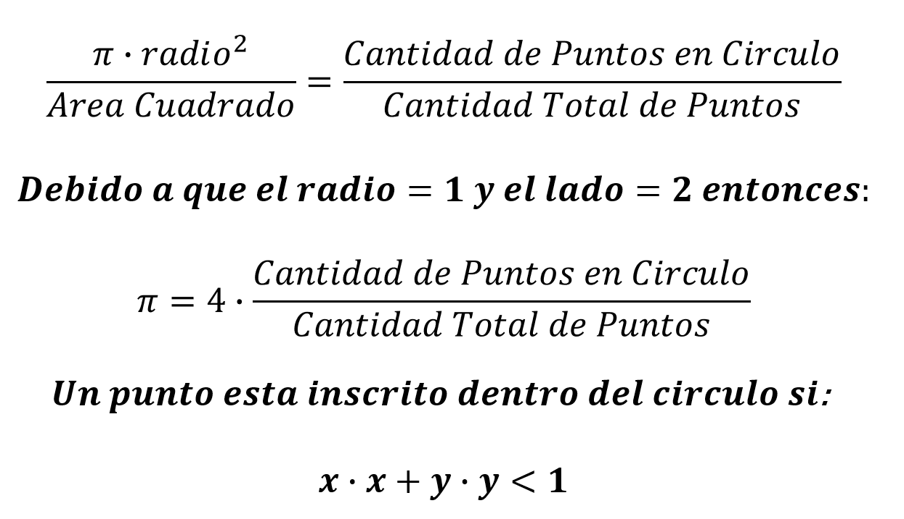

# Práctica Calificada #3 - 2021-0

Practica Calificada # 3 del curso de Programación Orientada a Objetos 2

## Indicaciones Especificas
- El tiempo límite para la evaluación es 90 minutos.
- Cada pregunta deberá ser respondida en un archivo cabecera (`.h`)  y/o en un archivo fuente (`.cpp`) de acuerdo a lo solicitado
- SOLO Deberás subir los siguiente archivos directamente a [www.gradescope.com](https://www.gradescope.com) o se puede crear un `.zip` que contenga todos ellos y subirlo :
    - `p1.h p1.cpp`

## Problema #1 - Calculo de PI - Programación concurrente (10 pts)
Como parte del proyecto Manhantan y en el desarrollo de la
bomba nuclear, se creo un método estadístico que se llamo **Montecarlo** en referencia a los casinos de Motercarlo en Monaco, este método resolvía por medio de aproximaciones el calculo de ecuaciones matemática muy complejas. Un uso didáctico de este método es el cálculo aproximado de la constante
PI, esto se logra definiendo un circulo de radio = 1 inscrito dentro de un cuadrado de lado = 2 (ver fígura). El modo de calcular el valor de PI se logra generando una cantidad muy grande de puntos, contar todos aquellos inscritos dentro del circulo y comparar con el total de puntos generados y utilizando  
la siguiente relación: 



Utilizando programación concurrente y utilizando **future**/ **promise** o **async**, elaborar la siguiente función, que permita calcular el valor aproximado de PI dividiendo el conteo de puntos dentro del circulo en cantidades proporcionales de acuerdo a la cantidad de hilos. 

```cpp
template <typename CounterType, typename ResultType>
ResultType get_pi(unsigned Iterations, unsigned Threads = 16)
```
Donde:  
**CounterType**, es el tipo que se utiliza para registrar el conteo de puntos del circulo y el conteo total.  
**ResultType**, es el tipo que se utiliza para devolver el valor de PI.  
**Iterations**, la cantidad total de puntos o iteraciones.  
**Threads**, la cantidad total de threads o async que serán utilizados para realizar el conteo.

**Caso de uso**
```cpp
    auto value = get_pi<int, double>(600000000, 1280);
    if (value > 3.1415 && value < 3.1417)
        cout << "Valor aproximado a PI" << endl;
```

NOTA: Asegurarse resolverlo de acuerdo a lo solicitado.
